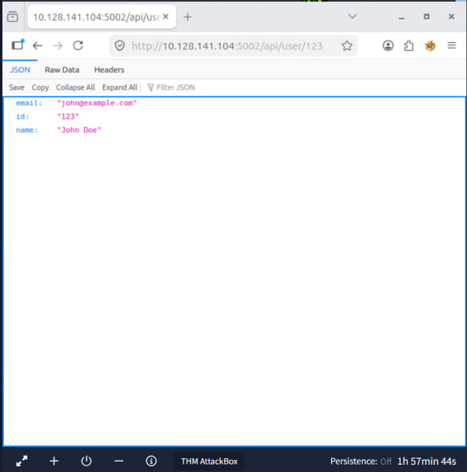
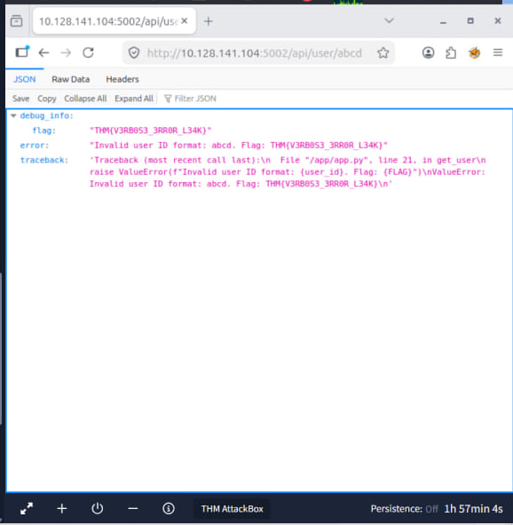
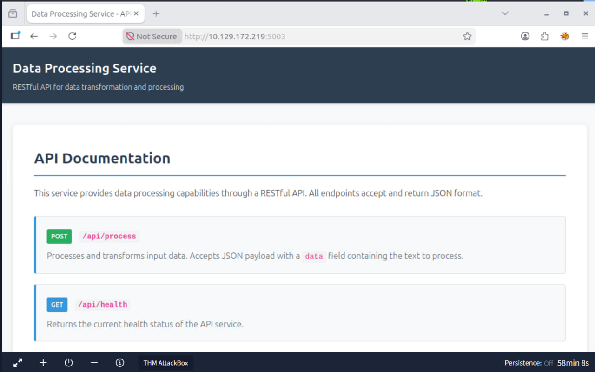
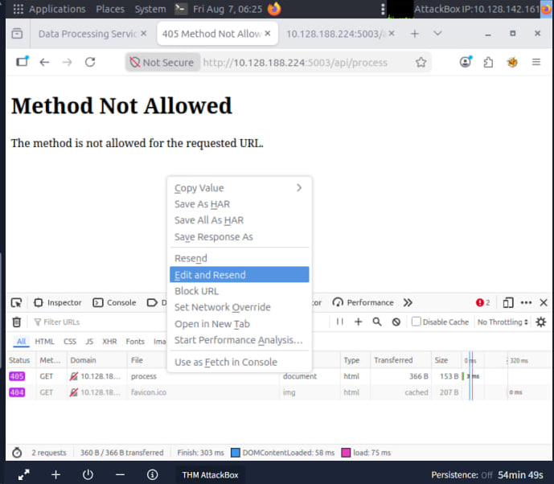
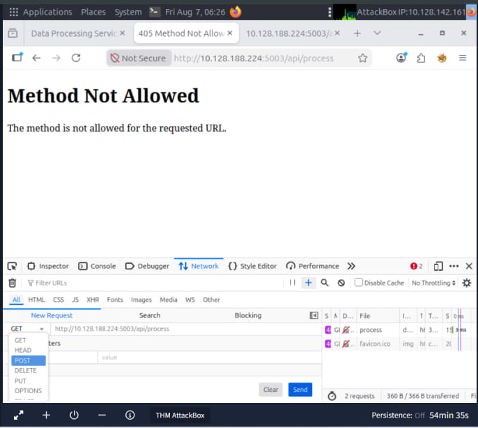
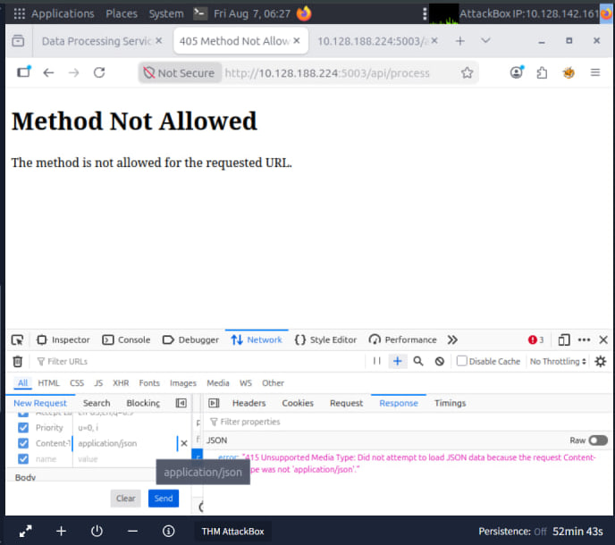
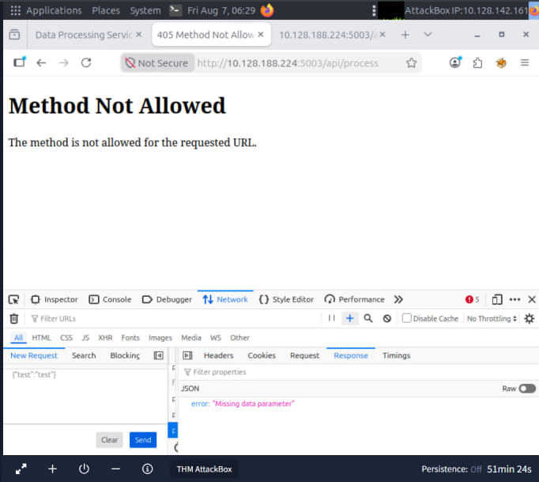
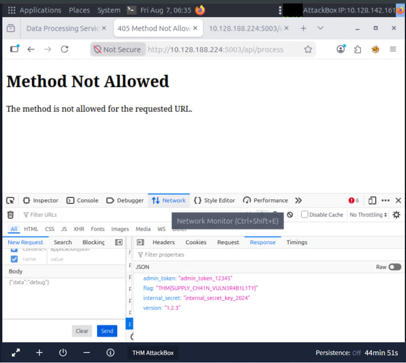

# Tasks

## AS02: Security Misconfigurations

### Introduction
* This room tell about Security Misconfiguration
* What it is Security Misconfiguration
* Why it matters 
* Its Common patterns
* How to prevent it
* flag
  
### Objective
* This rooms objective it to teach us about Security Misconfiguration and its cause how to prevent it and it gave a practical example

### What i learned 

#### What it is Security Misconfiguration?
* Security Misconfiguration are not code bugs they happen when a system or server is not deployed safely
* It happens when we use defaults, incomplete settings, exposed services

#### Why it matters and  Its Common patterns
* It matter because the slightest misconfiguration can lead to sensitive data being exposed, it enable privilege escalation and mostly it will give an attacker a foothold into our system and when all this happen it will compromise the whole system 
* As an example we can take the incident on 2017 when UBER exposed a backup AWS S3 bucket with sensitive user data
* The common patterns are default or weak passwords, Unnecessary services exposed, Misconfigured cloud storage, Unprotected APIs, Outdated software

####  How to prevent it
* change default settings
* use strong authentication
* keep software updated
* keep error messages simple(not showing too much sensitive information)
  
#### Flag
* We were asked to navigate , the developer left too many traces so how can we solve it
* In our browser we do http://MACHINE_IP:5002

  

* First lets try the normal API "http://MACHINE_IP:5002/api/user/123"

 

* But one important key the application says User ID must be numeric so instead of number we try a word or letters

  

* This is where the vulnerability appears we will get the flag
* The server should've just said Invalid user ID. but it exposes internal debugging information.

## AS03: Software Supply Chain Failures

### Introduction
* This room tell about Software Supply Chain Failures
* What it is Software Supply Chain Failures
* Why it matters 
* Its Common patterns
* How to prevent it
* flag

### Objective
* This rooms objective it to teach us about Software Supply Chain Failures and its cause how to prevent it and it gave a practical example

### What i learned 

#### What it is Software Supply Chain Failures
* Software Supply Chain Failures is when we fully rely on components, libraries, services, or models that are compromised, outdated, or improperly verified
* this vulnerability didn't come from our code but from the software and tools we depend on

#### Why it matters and  Its Common patterns
* Modern application are built from packages that are from third party, API and AI
* So One compromised dependency can compromise your entire system, allowing attackers to gain access without ever touching your own code
* We can take the 2021 incident as an example it happened on SolarWinds
* The common patterns using unsafe libraries, Unverified automatic update, Depending too much on third-party packages and Having weak CI/CD systems

####  How to prevent it
* Check third-party components
* Verify updates
* Secure CI/CD pipelines
* Track dependencies(where our libraries came from)

#### Flag
* The code the developer used is outdated and imports an old lib/vulnerable_utils.py component we were asked to debug it
* We open http://MACHINE_IP:5003

   

* It used outdated and old component so we go to its source code , on the source code we have an interesting part

   .jpg)

* The code means if we send debug as the data, the application will call debug info().
* So we will go to api/process and do inspect go to network then we will edit and resend it so the process is change the new request GET to POST

   

   

* Then we go Headers then add content and content type which is application/json

   

* After that we go Body and first we do a test we do
```
{"test":"test"}
```

  

* And it will give us our final clue which is "Missing data parameter" so we change the Body to
  ```
  {"data":"debug"}
  ```
* We hit send and we found our flag

  

# AS04: Cryptographic Failures

### Introduction
* This room tell about Cryptographic Failures
* What it is Cryptographic Failures
* Why it matters 
* Its Common patterns
* How to prevent it
* flag

### Objective
* This rooms objective it to teach us about Cryptographic Failures and its cause how to prevent it and it gave a practical example

### What i learned 

#### What it is Software Supply Chain Failures

* Cryptographic failures happen when encryption is used incorrectly or not at all. This includes weak algorithms, hard-coded keys, poor key handling, or unencrypted sensitive data

#### Why it matters and  Its Common patterns
* Web applications rely on cryptography everywhere: protecting network traffic, securing stored data, verifying identities, and safeguarding secrets
*  When Cryptographic failures happen sensitive data such as passwords, tokens, or personal information can be exposed
* The common patterns using weak encryption, hard-coded secrets, poor key management, invalid TLS certificates

####  How to prevent it
* Use strong encryption like AES-GCM or ChaCha20-Poly1305
* Store keys securely
* Rotate keys and secrets regularly
* Use valid TLS certificates
* Protect secrets in AI systems

#### Flag
* We are given the encrypted document we just need to know how to decrypt it we were given some clues like
* const SECRET_KEY = "my-secret-key-16"; const ENCRYPTION_MODE = "ECB"; const KEY_SIZE = 128;

  
  ![OWASP-Top-10-2025-Application-Design-Flaws](
  
# Insecure Design

### Introduction

* This room tell about  Insecure Design
* What it is  Insecure Design
* Why it matters 
* Its Common patterns
* How to prevent it
* flag

### Objective
* This rooms objective it to teach us about Insecure Design and its cause how to prevent it and it gave a practical example

### What i learned 

#### What it is Insecure Design

* This happens from the start when insecure design happens when defective logic or architecture is built into a system from the start
* Developers often assume that models are safe, correct, or predictable, or that the code they produce is flaw-free
* The perfect example is the Clubhouse
  
#### Why it matters and  Its Common patterns
* You can’t fix insecure design just by patching it. You need to change the way the system is designed, how it makes decisions, and how it handles trust and access.
* The common patterns are Weak recovery or approval processes, Wrong assumptions about users or AI behavior, AI systems with too much access, Missing safety controls for AI and automation, Test or debug features left enabled, No proper security testing or AI threat modeling  

####  How to prevent it or How to design securely 

* Treat AI models as untrusted
* Validate all inputs and outputs
* Separate system prompts from user content
* Protect sensitive data
* Require human approval for high-risk AI actions
* Monitor AI behavior and data sources
